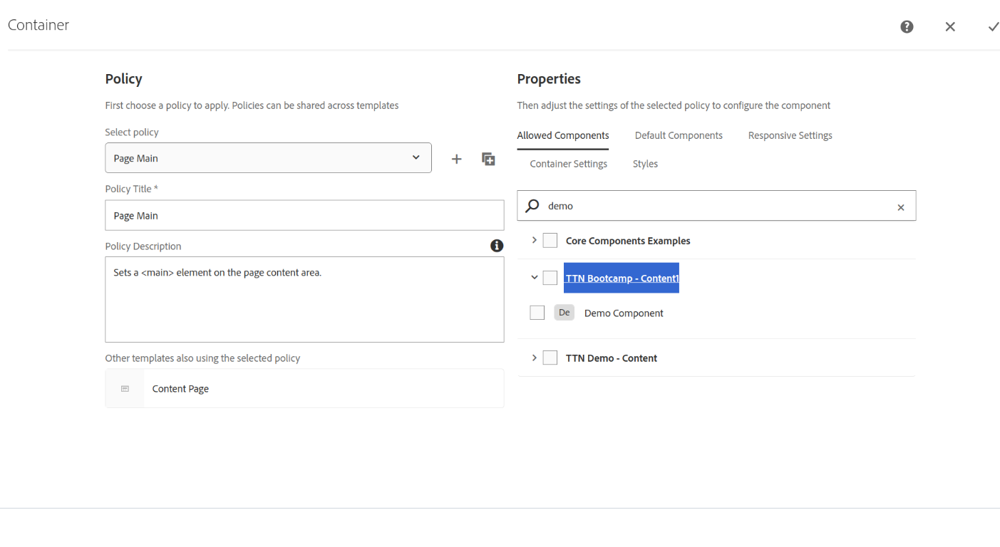

Q. Change the component Group to any custom name of your choice and then try dragging and dropping these component onto any page and try analyzing the dialogs (both on CRXDE and UI)

Solution: As per my observation, Initially the component group of Demo component was TTN Bootcamp - Content, and when we changed it to TTN Bootcamp - Content1. As result we are unable to add that component due to the group update.

If we want to use that component on any page now we are required to add group TTN Bootcamp - Content1 into the allowed group under the Policy.

