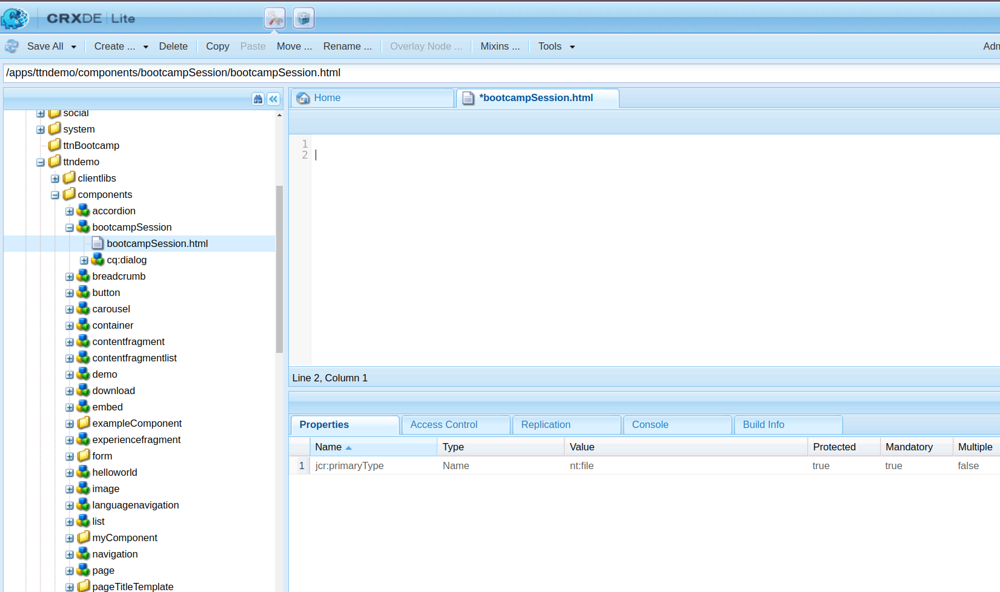
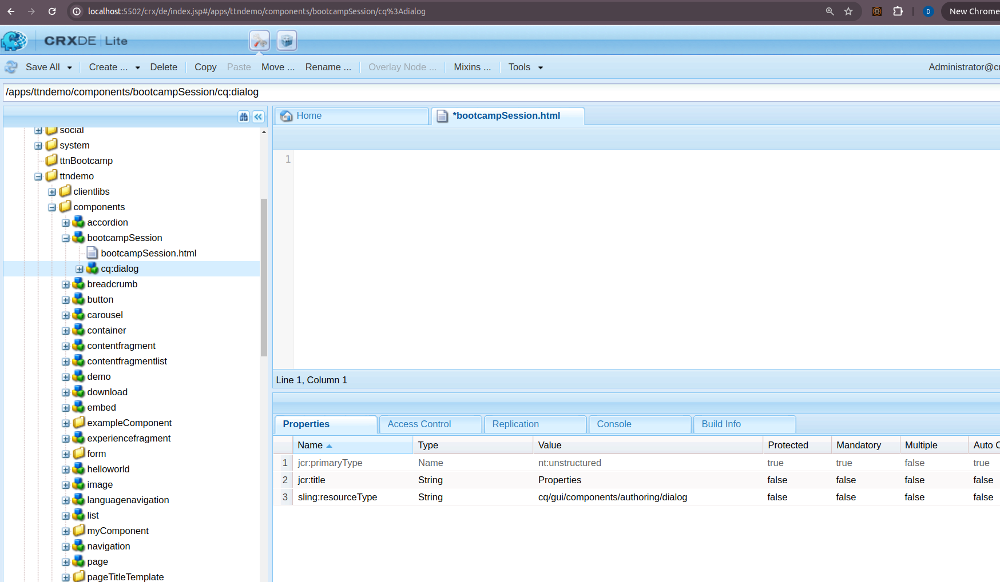
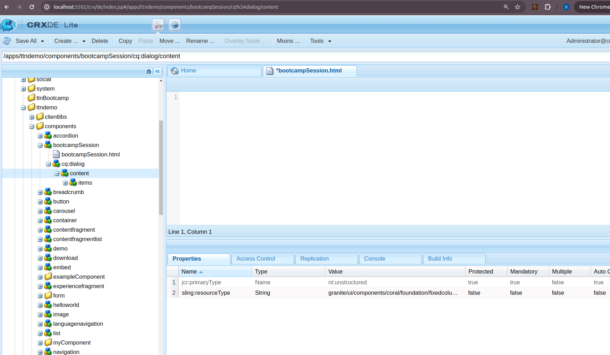
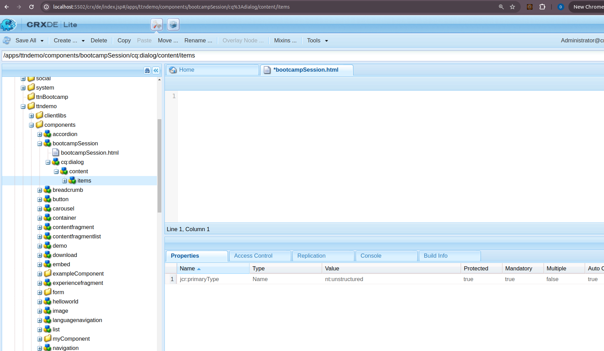
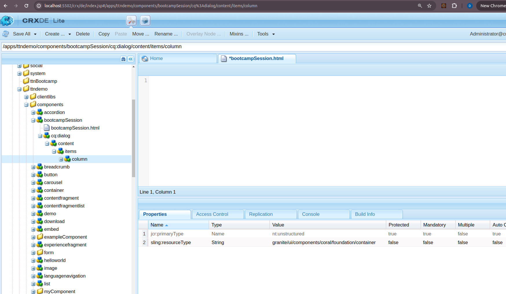
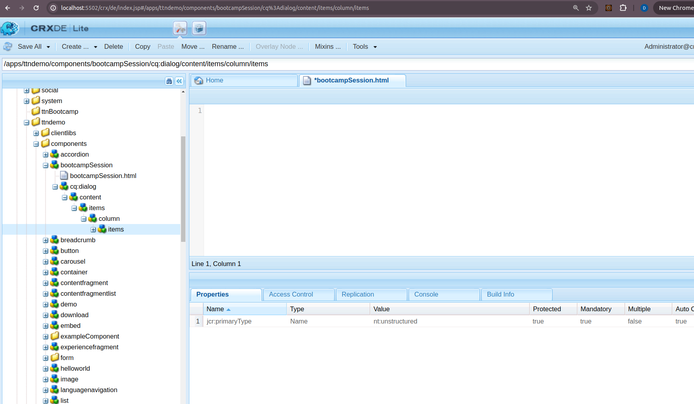
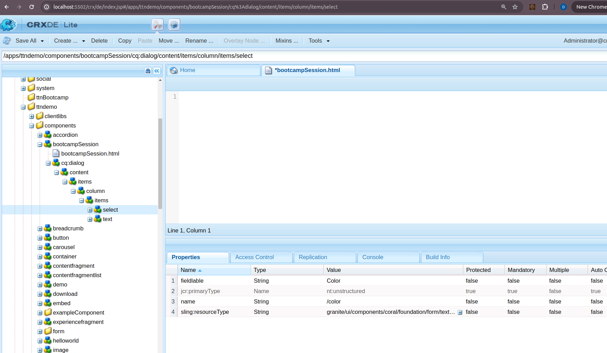
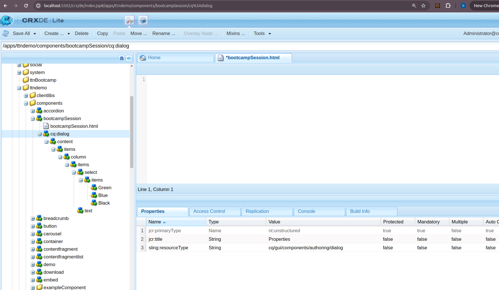

Question 1: Create a component with a dialog and having color drop down (green, blue, black etc) and one rich text editor for authoring text. This component is supposed to render text and apply chosen color to text.

Answer:

Step 1: create a node with primaryType cq:component and create a html file into that.

Step 2: Create a node with name cq:dialog into the component node of type nt:unstructured and add property sling:resourceType with value cq/gui/components/authoring/dialog, jcr:title with value Properties.

Step 3: Create a node with name content under the cq:dialog node of type nt:unstructured and add property sling:resourceType with value granite/ui/components/coral/foundation/fixedcolumns.

Step 4: Create a node with name items under the content node of type nt:unstructured.

Step 5: Create a node with name column under the items node of type nt:unstructured and add property sling:resourceType with value granite/ui/components/coral/foundation/container.

Step 6: Create a node with name items under the column node of type nt:unstructured.

Step 7: Create two nodes one for text and second for select both should be nt:unstructured and add property fieldlable with value Text/Color, name with value ./text/./color, sling:resourceType with value granite/ui/components/coral/foundation/form/textfield/granite/ui/components/coral/foundation/form/select.

Step 8: Create a node with name green,blue,black under the items node of type nt:unstructured and add property text with value green,blue,black.

