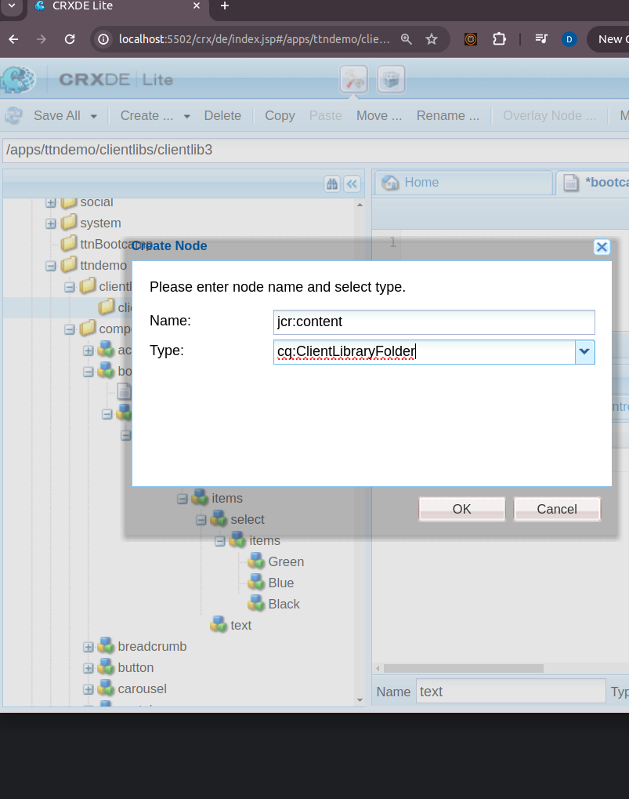
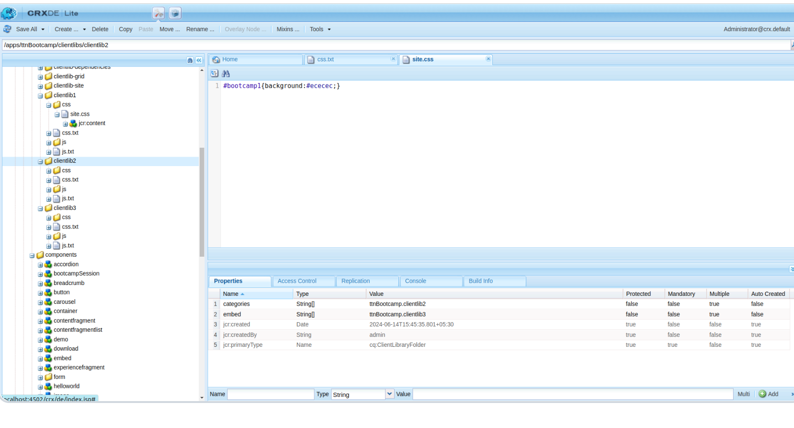
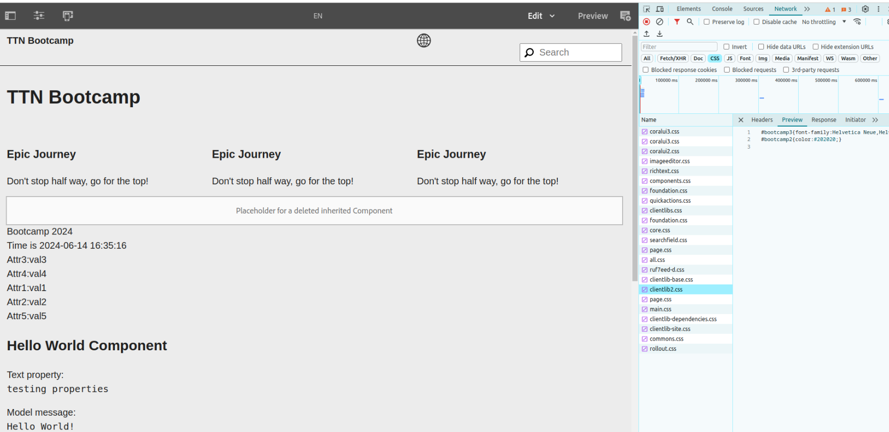

Question 3: Create 3 clientlibs. Embed clientlib3 in clientlib2 and clientlib2 in clientlib1. State the observation with respect to the number of calls and content of clientlib.

Step 1: Create the Clientlibs Folder Structure
In the left-hand panel, navigate to the /apps directory.
Right-click on the apps folder and select Create > Create Folder. Name the folder ttndemo.
Right-click on the ttndemo folder and select Create > Create Folder. Name the folder clientlibs.

Step 2: Create a Client Library Folder
Right-click on the clientlibs folder and select Create > Create Folder. Name the folder clientlib-example (or any name of your choice).
Right-click on the clientlib-example folder and select Create > Create Node. Name the node jcr:content and set the primary type to cq:ClientLibraryFolder.
Step 4: Add Client Library Files
Inside the clientlib-example folder, create the following files and folders:

css.txt
js.txt
css (folder)
js (folder)
css.txt:

Right-click on clientlib-example and select Create > Create File. Name the file css.txt.
Add the names of the CSS files that you will include in the css folder.

Result -> In result when we request for the clientlib1, it has properties from clientlib1, and clientlib2 only.

So, as Observed embed cannot achieve on multi-level. Embed is allowed for one level. If we have such case that we required to embed above client libs, we have to embed all at one level e.g. clientlib3 in clientlib1, and clientlib2 in clientlib1.

