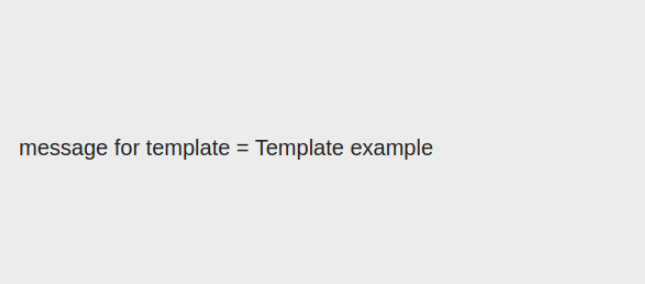

Q2: Write a Sightly template named pageTitleTemplate that takes a single parameter title and renders it within an h1 tag.

Step1: In CRXDE Lite, navigate to the following path:
/apps/ttnDemo/components

Step 2: Create the Component Folder
Right-click on components and select Create > Create Folder.
Set the Name to pageTitleTemplate.

Step 3: Create the Sightly Template File
Right-click on the pageTitleTemplate folder and select Create > Create File.
Set the Name to pageTitleTemplate.html.

Code:

<template data-sly-template.include="${@ message}">

 message for template = ${message} 

</template>

Step 4: Add the Template Code to pageTitleTemplate.html
Click on the newly created pageTitleTemplate.html file to open it in the CRXDE Lite code editor.
Insert the following HTL code into pageTitleTemplate.html:

Step5: Include the template into the component.

Code:

<sly data-sly-use.temp="${'pageTitleTemplate.html'}"
data-sly-call="${temp.include @ message='Template example'}"/>

