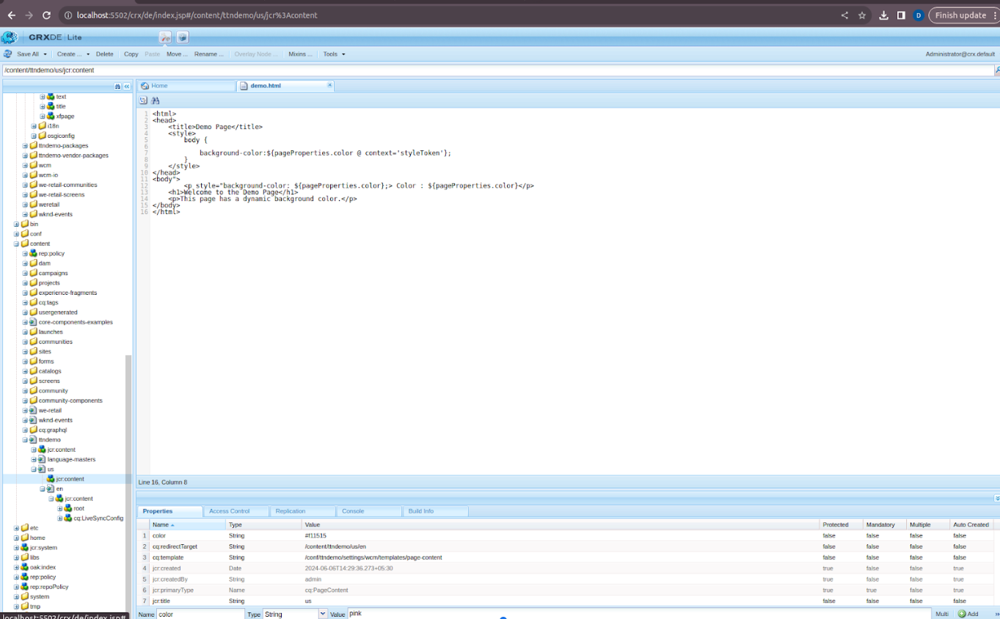
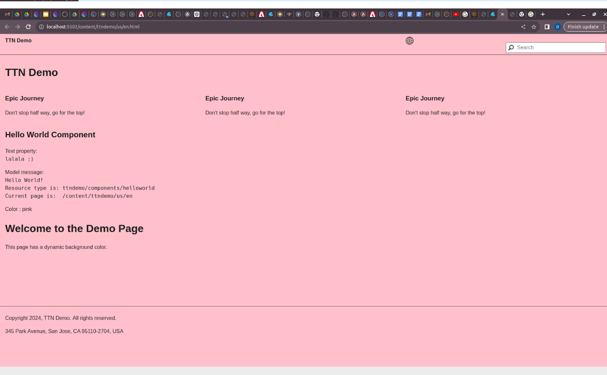
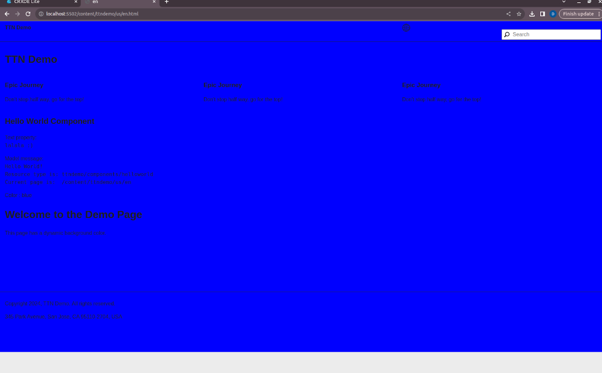

Q3 ) Read the color property from the current node and set it as the background of the
page.
Step1: Start the Author Instance**:
    - Open a terminal and navigate to your AEM installation directory.
    - Run the following command to start the author instance:

      java -jar aem-author-p5502.jar

Step2: Open AEM in the Browser**:
    - Once the author instance is up, open your browser and navigate to:

      http://localhost:5502/aem/start.html

Step3: Click on `CRXDE Lite` in the AEM interface.

Step4: Navigate to the Component:
    - In CRXDE Lite, navigate to the following path:

      /apps/ttnDemo/components/demo

    - Click on `demo.html`.

Step5: Open /apps/ttndemo/components/demo/demo.html and update `demo.html`**:
    - Add the following code to `demo.html`:

Step7: Set the name property for the color that you want to display on your screen.
Step8: Save the changes.

Step9: View the Page:
    - Open your browser and navigate to:

      http://localhost:5502/content/ttndemo/us/en.html

It will change the background color to pink.

