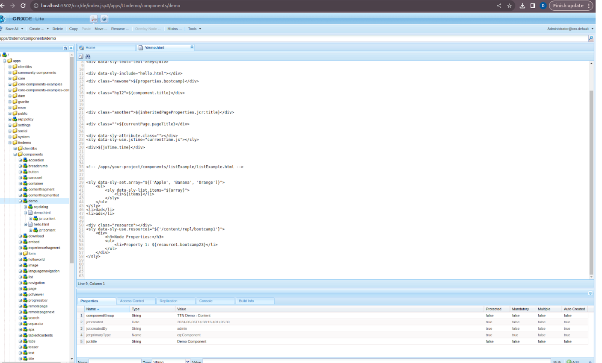

Q1) Print current time.

1. **Start the Author Instance**:
    - Open a terminal and navigate to your AEM installation directory.
    - Run the following command to start the author instance:

      java -jar aem-author-p5502.jar

2. **Open AEM in the Browser**:
    - Once the author instance is up, open your browser and navigate to:

      http://localhost:5502/aem/start.html

3. **Access CRXDE Lite**:
    - Click on `CRXDE Lite` in the AEM interface.

4. **Navigate to the Component**:
    - In CRXDE Lite, navigate to the following path:

      /apps/ttnDemo/components/demo

    - Click on `demo.html`.

5. **Create a JavaScript File**:
    - Within the `demo` component folder, create a new JavaScript file named `currentTime.js`.
    - Add the following code to `currentTime.js`:

      use(function () {
      const now = new Date();
      const formattedTime = now.toLocaleString();
      return {
      time: formattedTime
      };
      });

6. **Update `demo.html`**:
    - Add the following code to `demo.html`:

     <sly data-sly-use.jsTime="currentTime.js"></sly>
     
${jsTime.time}

7. **View the Page**:
    - Open your browser and navigate to:

      http://localhost:5502/content/ttndemo/us/en.html

    - The current time will be displayed on the screen.

OUTPUT:

