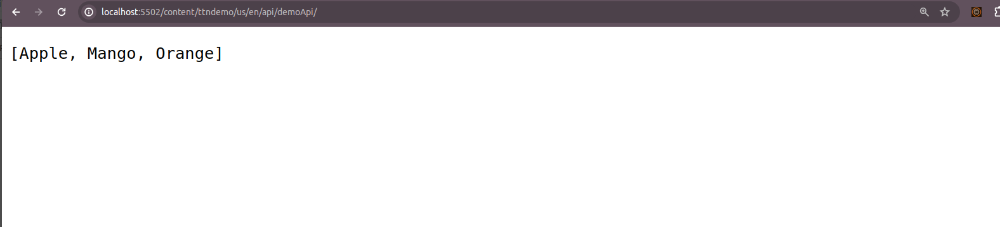
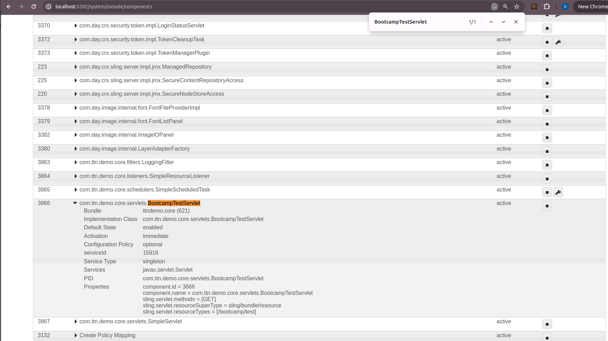
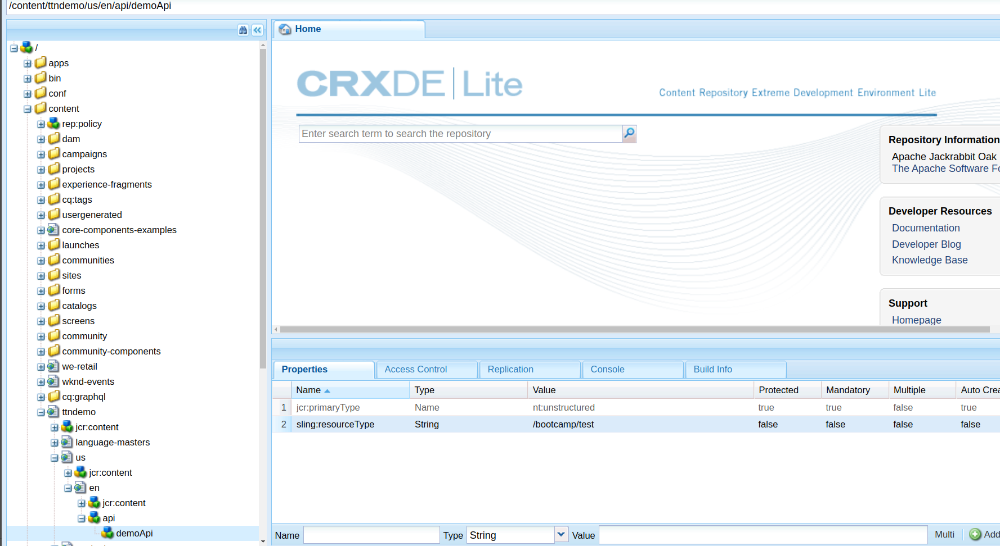
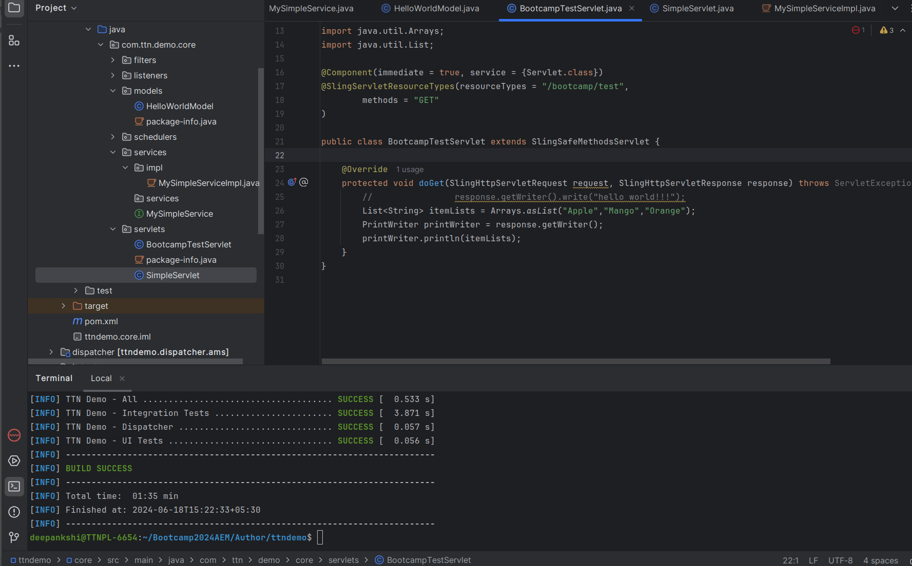

Q. Get Servlet - Make a list in java servlet and retrieve that list.

Step1 : Import Necessary Packages:
- Ensure you have the necessary imports for the servlet to function.

Step2: Component Annotation:
- Configure the servlet to respond to GET requests at the specified resource type.

Step3: Servlet Implementation:
- Override the doGet method to create a list and return it as part of the response.

Step4: Build and Deploy:

- Build your AEM project and deploy the code to your AEM instance.
- Access the Servlet:

Step5: Open a web browser and navigate to http://localhost:5502/content/ttndemo/us/en/api/demoApi/

