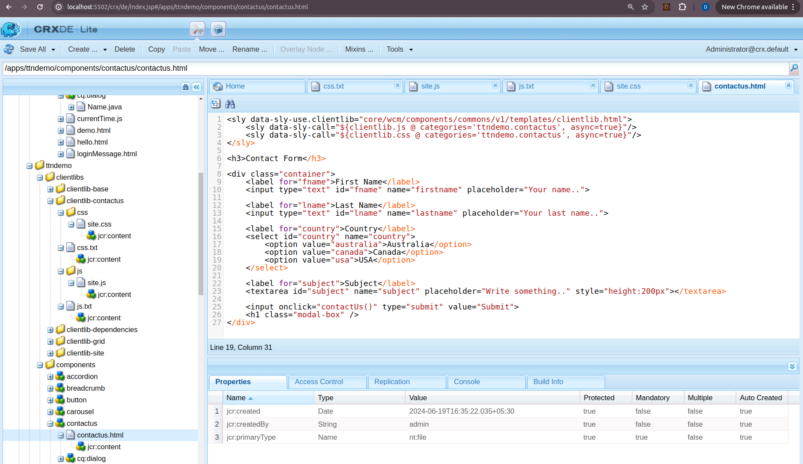
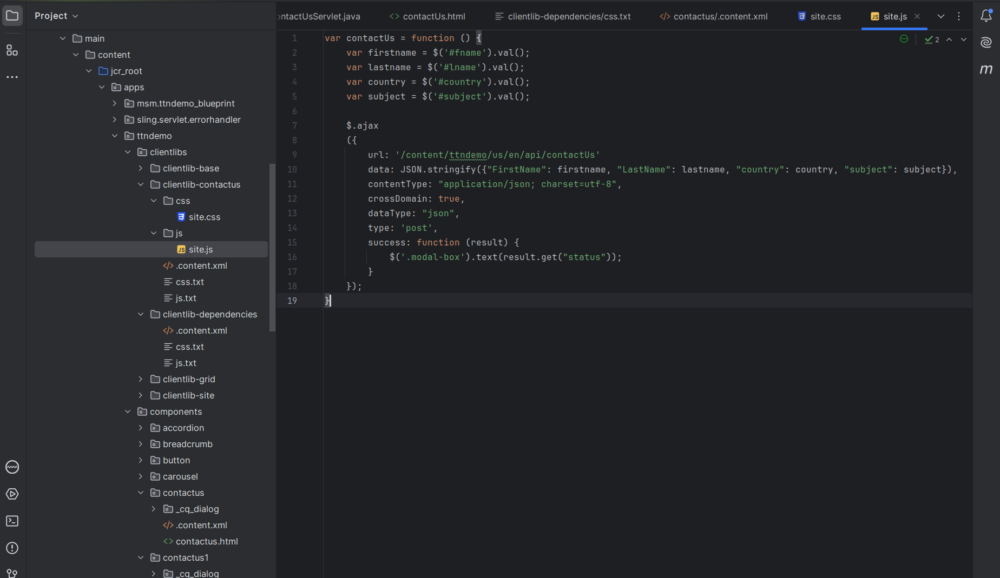
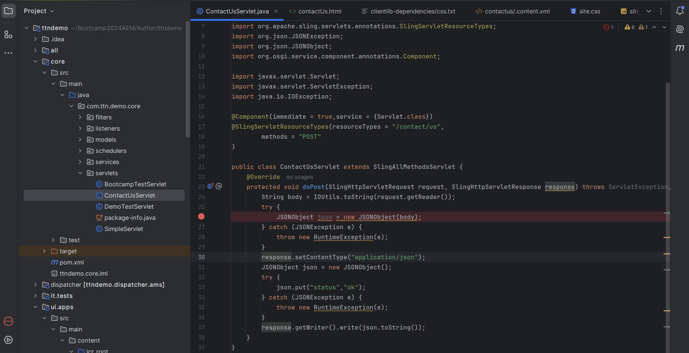
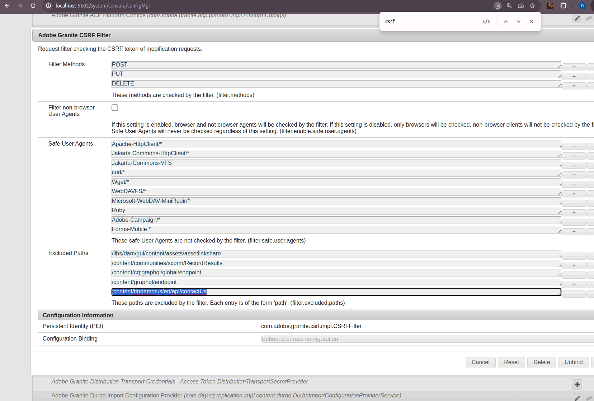
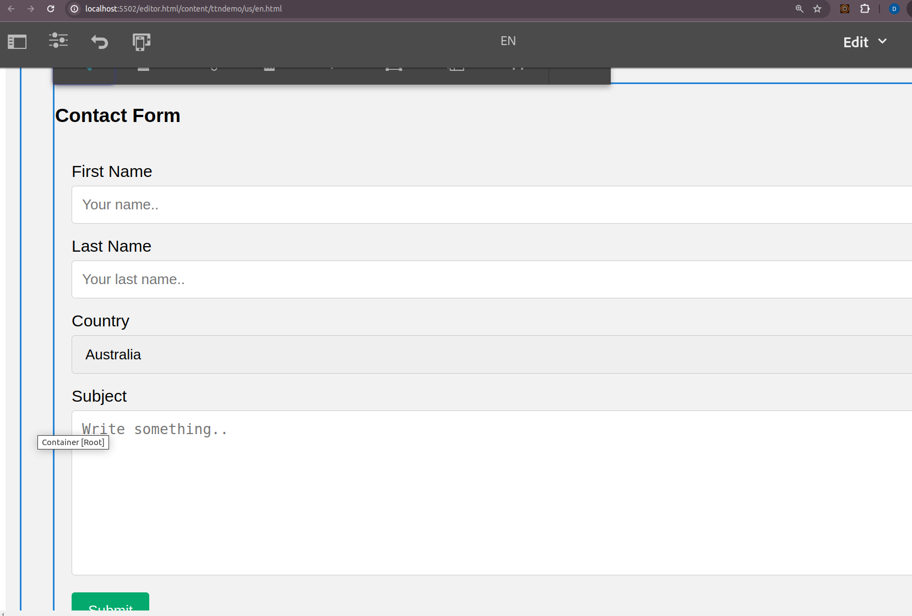

Q) Create a contact us form. Send form data (json) from front end and Save to AEM Node.

Step1: Create the Contact Us Component:

Path: /apps/ttndemo/components/contactus/contactus.html
Add HTML code for the contact form.

Step2: Create Client Libraries:

Path: /apps/ttndemo/clientlibs/clientlib-contactus
Add site.css and site.js files.
Create content.xml to define the client library.

Step3: Create the Servlet:

Path: /home/deepankshi/Bootcamp2024AEM/Author/ttndemo/core/src/main/java/com/ttn/demo/core/servlets/ContactUsServlet.java
Add Java code to handle form submissions.

Step4: Configure the Servlet Path:

Add the path to the OSGi Configuration Manager.

Step5: Open the Contact Us Form:

Navigate to the specified URL to view and use the form.

