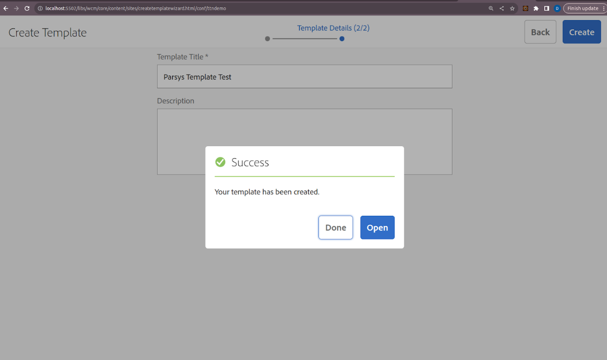
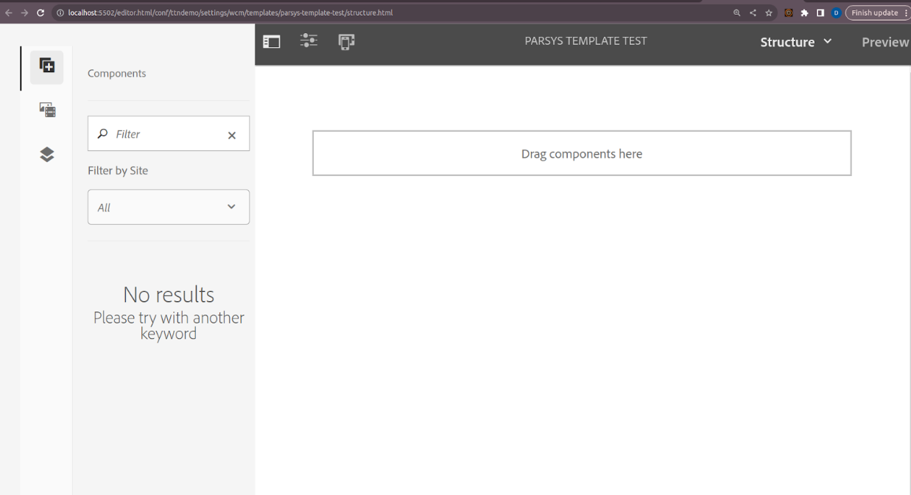
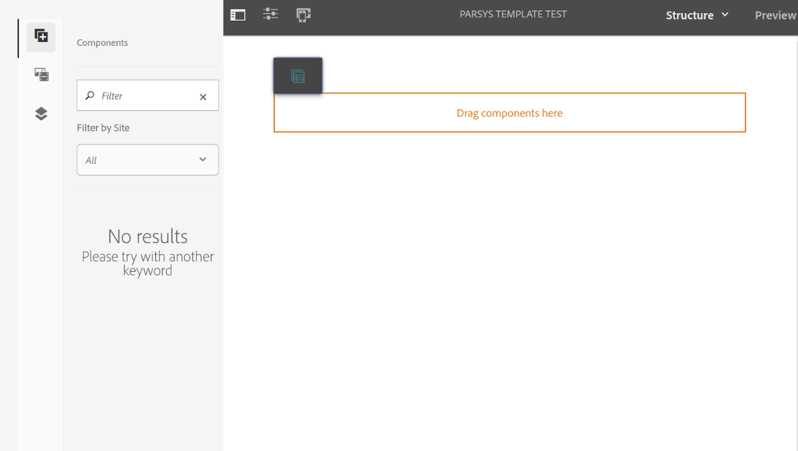
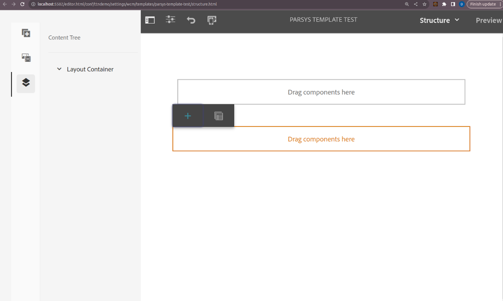
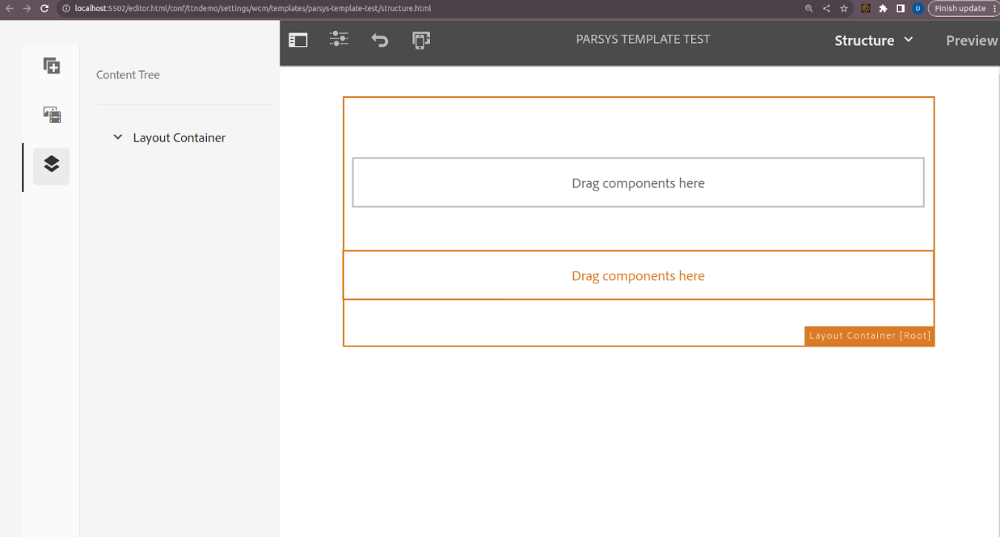
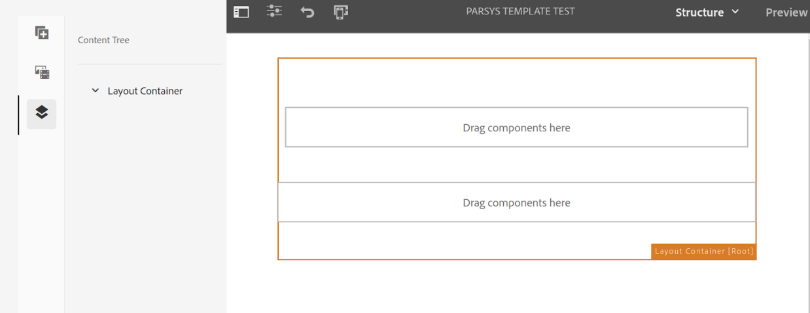

Q4) Add a parsys (responsive grid/layout container) in the above template such that author can add any component from group “General” on the page.
To add a parsys (responsive grid/layout container) to a template in Adobe Experience Manager (AEM) and configure it to allow authors to add any component from the group "General" on the pages created from that template, follow these steps:

Step 1: Navigate to the Template Editor

1. Go to the Templates Console:
    - In AEM, navigate to AEM Start > Navigation > Templates.

2. Open the Template:
    - Select the appropriate template (e.g., T1 or T2) or create a new one if you haven't already.
    - Click on Edit to enter the template editor.

Step 2: Add a Layout Container (Parsys)

1. Access the Layout Container:
    - In the template editor, click on the Layout Container** to modify the structure where you want to add the parsys.

2. Add the Responsive Grid (Layout Container):
    - Drag and drop the Layout Container or Responsive Grid** component from the side rail into the desired location within the template.

Step 3: Configure the Policy for the Layout Container

1. Open Policy Configuration:
    - Select the newly added layout container in the template.
    - Click on the Policy icon (it looks like a wrench or gear) that appears in the toolbar above the selected container.

2. Create or Edit Policy:
    - In the policy editor, either create a new policy or edit an existing one that applies to the layout container.

3. Allow Components from the "General" Group:
    - In the policy configuration, find the section for Allowed Components.
    - Enable Allow All or specifically enable the group "General".
    - Ensure that all necessary components from the "General" group are selected to be available for authors.

4. Save the Policy:
    - Save your changes in the policy editor.

Step 4: Enable and Publish the Template

1. Enable the Template:
    - Exit the template editor and return to the templates console.
    - Select the template and click on the **Enable button to make it available for use.

2. Publish the Template:
    - Publish the template to ensure it is available for creating pages.

Step 5: Create Pages Using the Template

1. Go to Sites Console:
    - Navigate to AEM Start** > Navigation** > Sites.

2. Create a New Page:
    - Click on Create and choose the template you configured (e.g., T1 or T2).
    - Fill in the necessary page details and create the page.

3. Verify the Layout Container:
    - Open the newly created page.
    - You should see the layout container (parsys) you added in the template.

4. Add Components:
    - Authors can now click on the layout container to add components.
    - They should be able to see and add any component from the "General" group as configured in the policy.

Paryss template -> when drag and drop component (+) .

