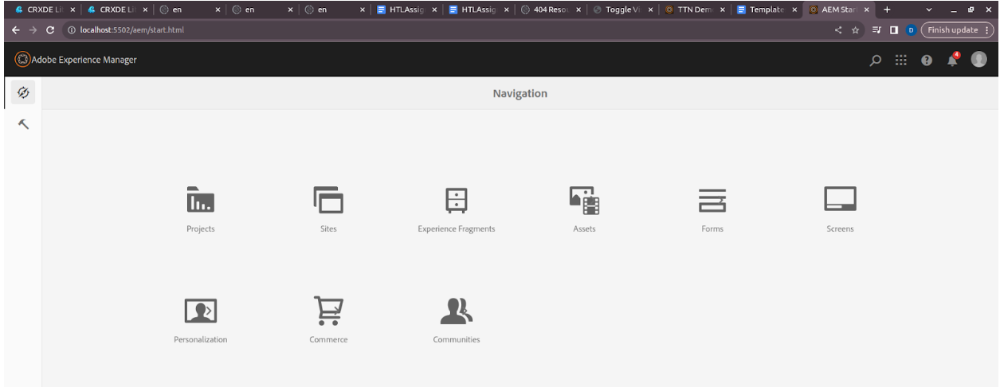
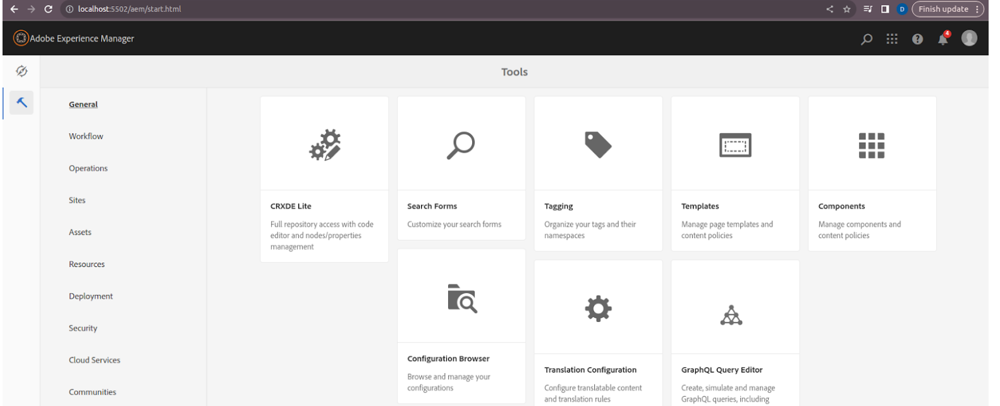
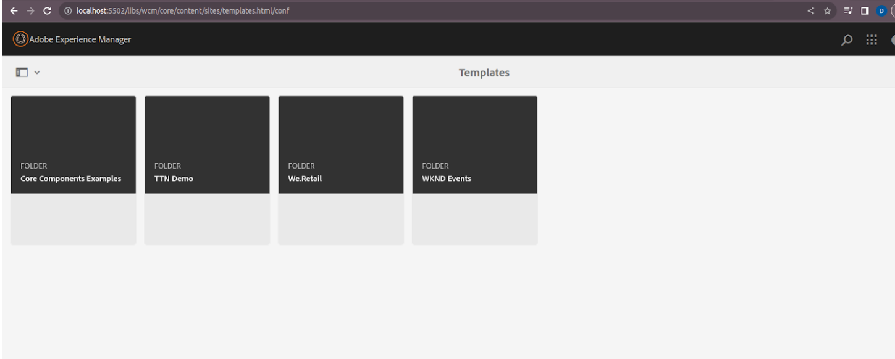
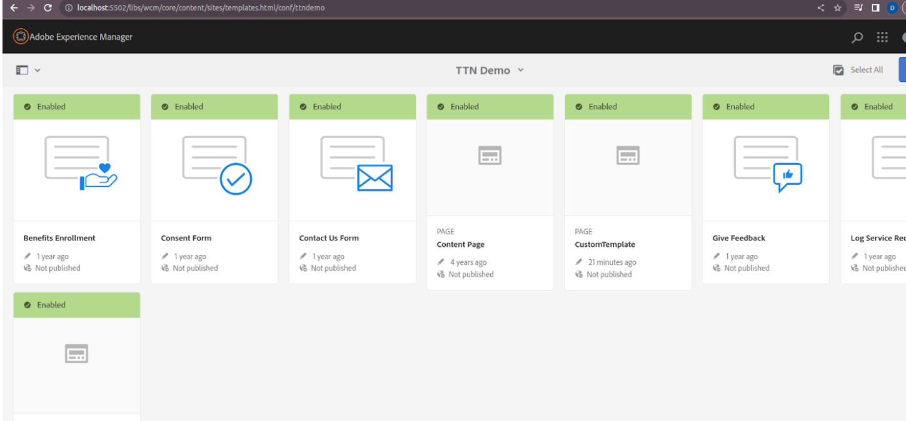
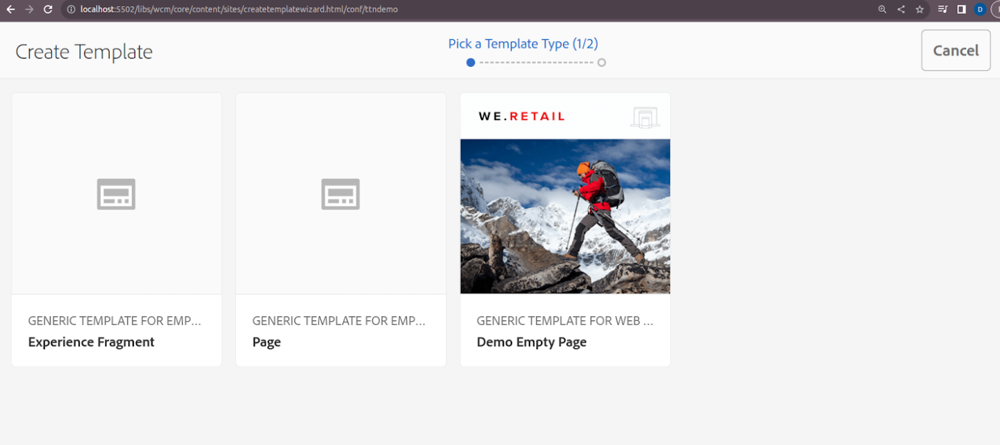

Q1) Create a template from custom template type.

Steps to Create a Template
1. Start the Author Instance:
    - Start the author instance by running the command: `java -jar aem-author-p5502.jar`.
2. Sign In:
    - Sign in on the Adobe page. This will open the page for creating templates.
3. Open the Author Instance in Browser:
    - Open your browser and navigate to [http://localhost:5502/aem/start.html](http://localhost:5502/aem/start.html).
   
4. Access the Tools:
    - Click on the "Tools" button to open the tools menu.
   
5. Navigate to Templates:
    - Click on the "Templates" option in the tools menu.
6. Open TTN Demo Folder:
    - Click on the "TTN Demo" folder.
   
   
7. Copy the Empty Page Template:
    - Click on the `we-retail` folder and copy the `empty-page` template.
8. Paste into Template Types:
    - Navigate to `ttnDemo -> settings -> wcm -> template-types`.
    - Paste the `empty-page` template into the `template-types` folder. This will create `empty-page` under `/conf/ttndemo/settings/wcm/template-types/empty-page`.
9. Rename the Template:
- Right-click on the newly pasted template and rename it to something unique, like `Unique-page`.
10. Save and Refresh:
- Save your changes and refresh the URL: [http://localhost:5502/libs/wcm/core/content/sites/createtemplatewizard.html/conf/ttndemo](http://localhost:5502/libs/wcm/core/content/sites/createtemplatewizard.html/conf/ttndemo).
11. Verify the Template:
- The newly created template will now be displayed.

  OUTPUT:

