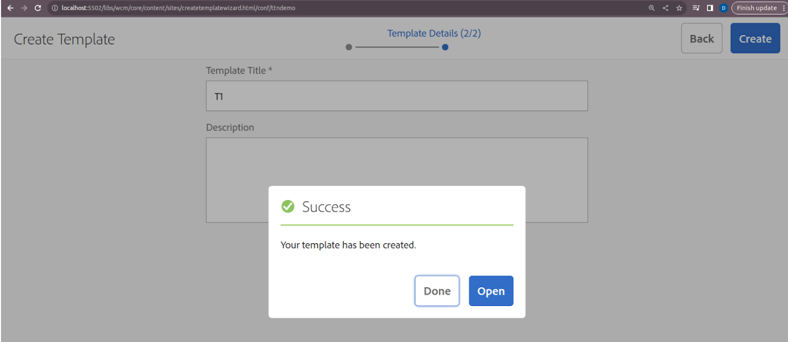
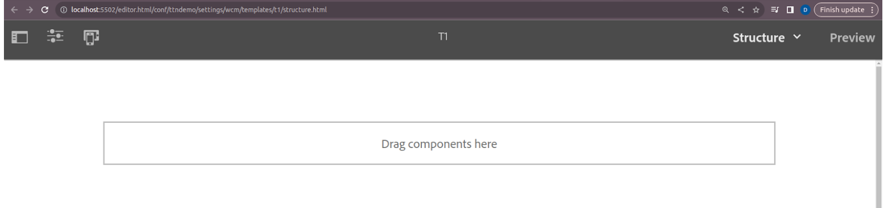
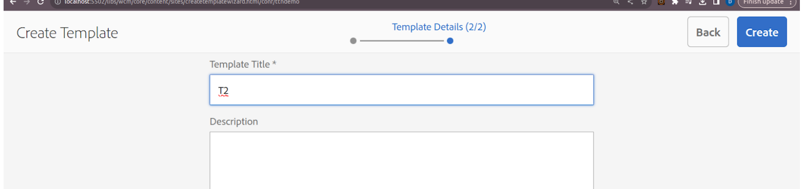
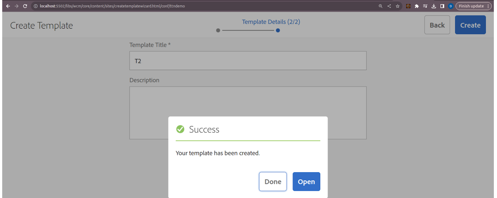
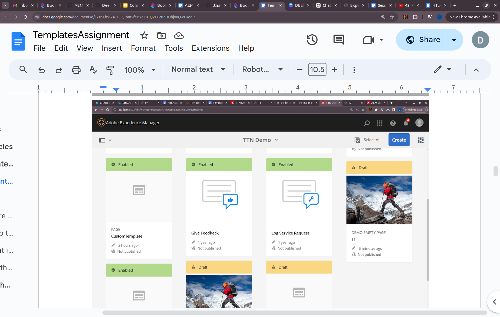
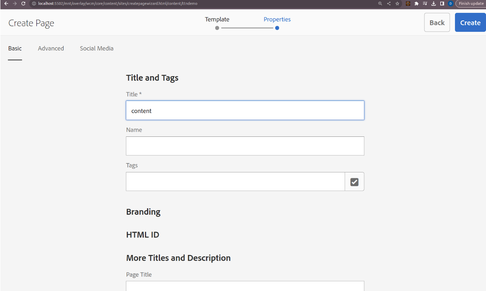
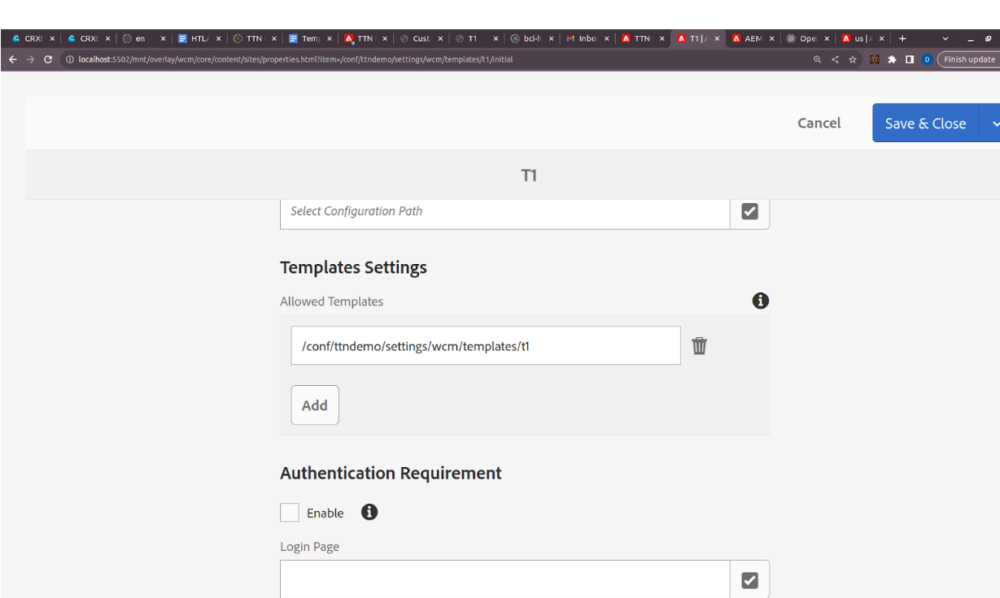
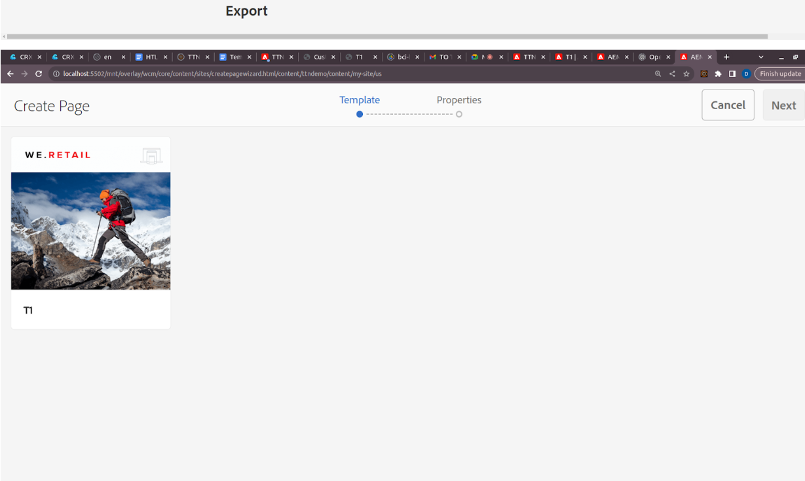
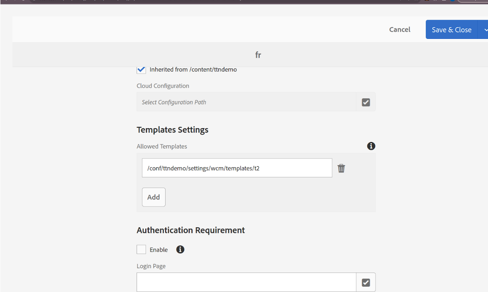
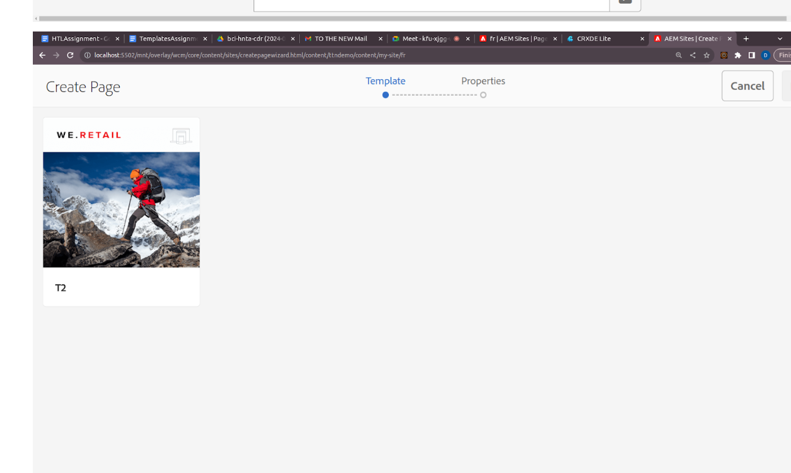

Q2) Create two templates T1 and T2 such that T1 is only allowed under hierarchy “/content/my-site/us” and T2 is only allowed under “/content/my-site/fr”

Step 1: Create the Templates
1. Create Template T1:
-Navigate to the Templates console in AEM.
-Click Create and follow the prompts to create a new template.
-Name it T1 and configure it as needed.
-Save and enable the template.

2. Create Template T2:
-Repeat the steps above to create a new template named T2.

Step 2: Define Template Policies
1. Open the Policy Editor:
-Navigate to Tools > General > Configuration Browser.
-Create or select an appropriate configuration for your site, such as /conf/my-site.
-Create Template Policies:
-Within the configuration, create policies for each template. These policies will be applied to specific paths.

Step 3: Apply Policies to Content Paths

1. Restrict T1 to /content/my-site/us:
-Navigate to the Page Policies section of the configuration.
-Create a new policy or select an existing one.
-Under the Allowed Templates section, only add T1.
-Save the policy.

2. Restrict T2 to /content/my-site/fr:
-Navigate to the Page Policies section of the configuration.
-Create a new policy or select an existing one.
-Under the Allowed Templates section, only add T2.
-Save the policy.

Step 4: Assign Policies to Content Structure
1. Assign Policy to /content/my-site/us:
-Navigate to Page Properties of the root page /content/my-site/us.
-Under the Advanced tab, set the Policy to the one created for T1.
-Save the changes.
2. Assign Policy to /content/my-site/fr:
-Navigate to Page Properties of the root page /content/my-site/fr.
-Under the Advanced tab, set the Policy to the one created for T2.
-Save the changes.

