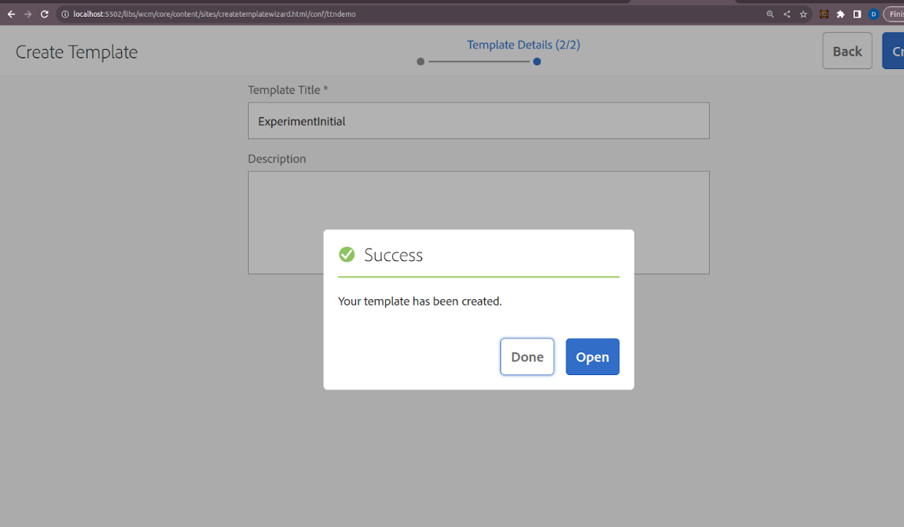
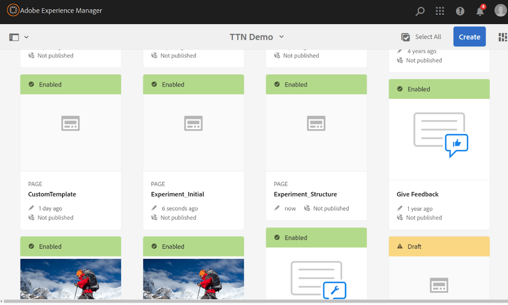
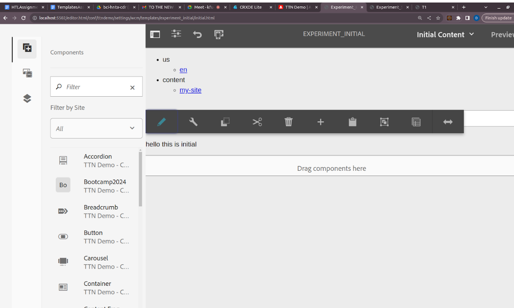
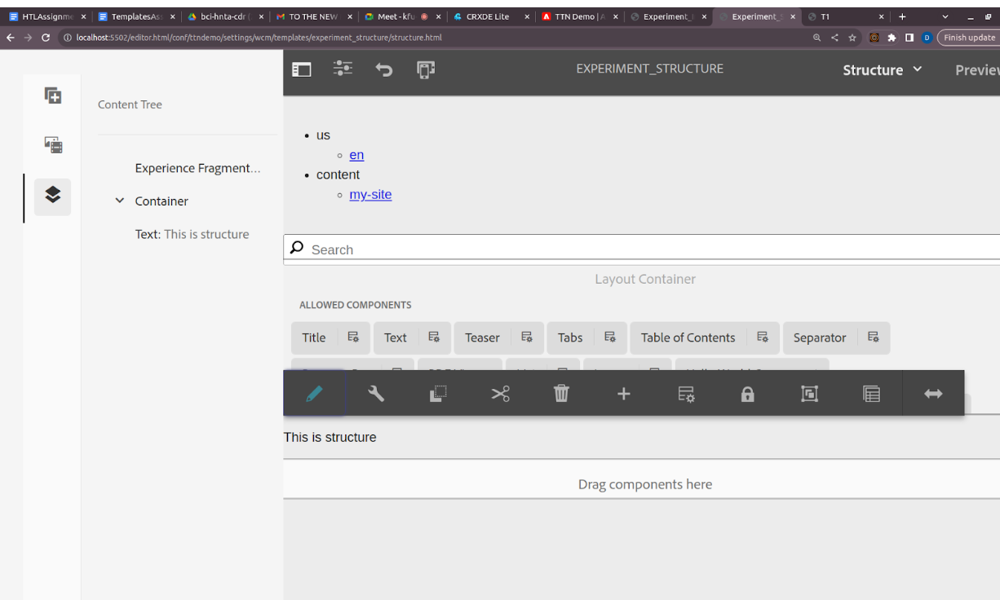
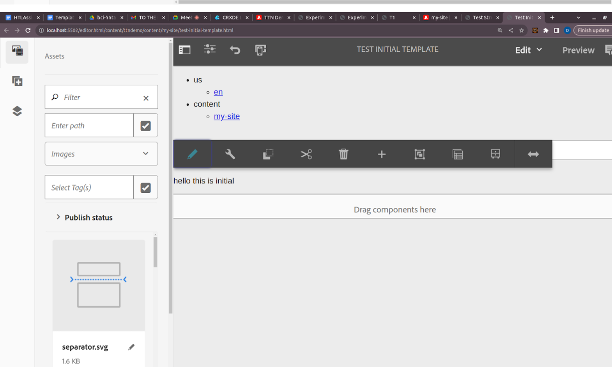
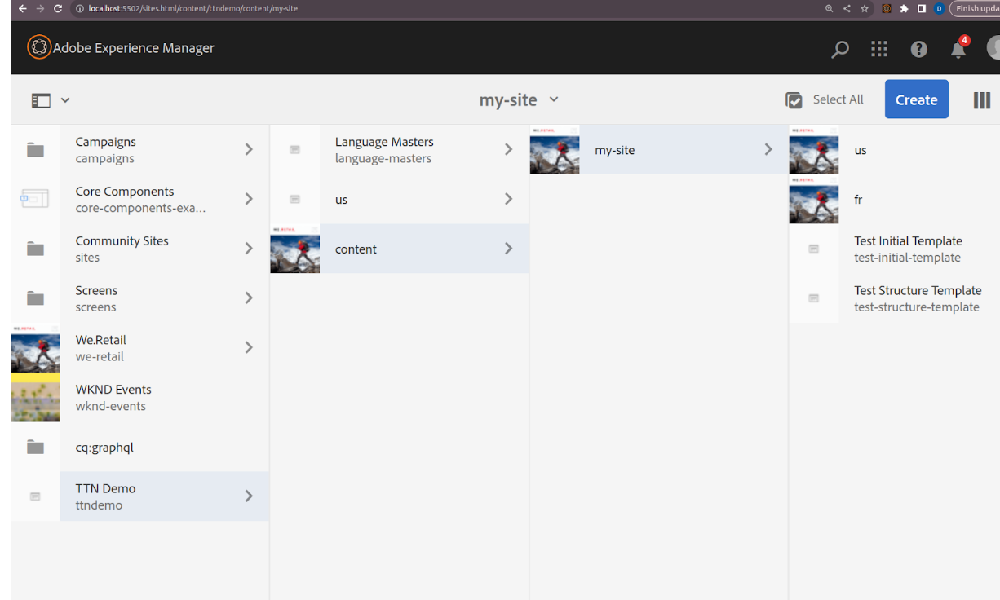

Q3) Add a component on a template such that the content (authored properties) of the component remains exactly same on all the pages created using that template.

Step 1: Create and Configure the Template
1. Navigate to the Template Console:
- Go to AEM Start > Navigation > Templates.
2. Create or Edit the Template:
- Select the appropriate template (e.g., T1 or T2) or create a new one by clicking Create.
- Enter the template editor by clicking Edit.

Step 2: Add a Component to the Template
1. Open the Template Structure:
- In the template editor, click on Layout Container to access the structure where you can add components.
2. Add the Component:
- Drag and drop the desired component (e.g., a text component) from the side rail into the layout container.
3. Configure the Component:
- Click on the component to open its configuration dialog.
- Enter the desired static content (e.g., Title, Description) that should remain the same across all pages created from this template.
- Save the configuration.

Step 3: Lock the Component in the Template
1. Lock the Component Configuration:
- With the component selected, look for the toolbar that appears. It should have a lock icon.
- Click on the lock icon to lock the component. This prevents content authors from changing the component's properties on individual pages.

Step 4: Enable and Publish the Template
1. Enable the Template:
- Exit the template editor and return to the template console.
- Select the template and enable it by clicking the Enable button.
2. Publish the Template:
- Publish the template to ensure it is available for use in page creation.

Step 5: Create Pages Using the Template
1. Navigate to Sites Console:
- Go to AEM Start > Navigation > Sites.
2. Create a New Page:
- Click Create and choose the template you configured (e.g., T1 or T2).
- Fill in the necessary page details and create the page.
3. Verify the Static Component:
- Open the newly created page.

