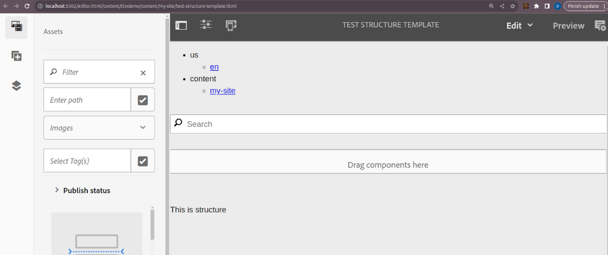
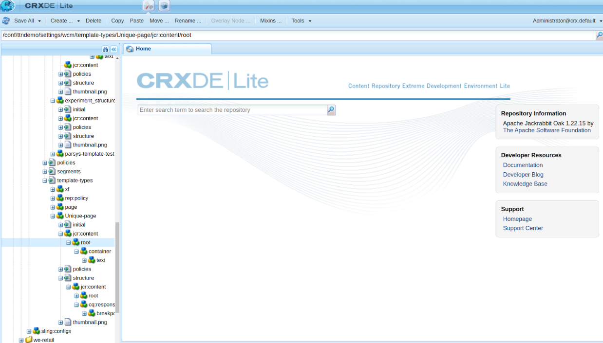
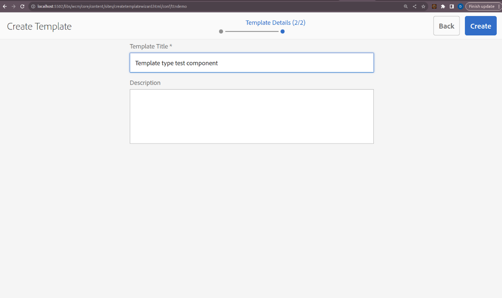
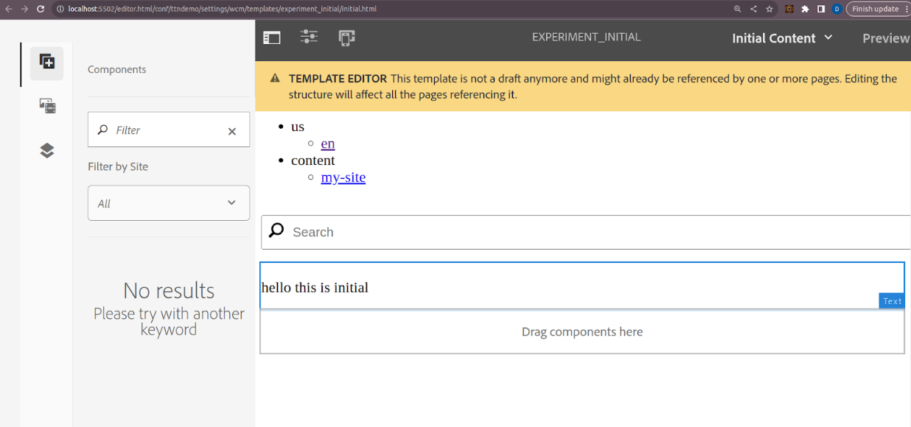

Q5) Define a component in such a way that content remains same on all pages created using a common template and the authored content can be reused on other templates as well without any re-authoring of the content.
Sure, here's how to define a component in AEM such that the content remains the same on all pages created using a common template, and the authored content can be reused on other templates without any re-authoring, using AEM's interfaces without direct coding:

Step-by-Step Guide Using AEM Interface

Step 1: Create a Central Content Location

1. Navigate to AEM Sites:
    - Go to AEM Start > Navigation > Sites.

2. Create a Central Content Page:
    - In the Sites console, create a new page under a central location (e.g., `/content/shared-content`).
    - Use a suitable template (e.g., a blank page or any existing template).
    - Name it something like "Shared Content".

3. Add Content:
    - Open the newly created "Shared Content" page.
    - Add the desired components (e.g., text, images) that you want to share across multiple templates and pages.
    - Author the content as needed.

4. Publish the Central Content Page:
    - Ensure the content is published so it can be referenced by other pages.

Step 2: Create or Edit Templates to Include the Central Content

1. Navigate to Templates:
    - Go to AEM Start > Navigation > Templates.

2. Edit or Create a Template:
    - Select the template you want to edit (e.g., T1 or T2), or create a new template.
    - Click on Edit to open the template editor.

3. Add a Reference Component:
    - In the template editor, add the Content Fragment** or **Experience Fragment component to the desired location within the template structure.
    - This component will be used to pull in the central content.

4. Configure the Reference Component:
    - Click on the Content Fragment or Experience Fragment** component to open its configuration dialog.
    - Set the Path to the central content page you created (e.g., `/content/shared-content/my-shared-content`).

5. Lock the Component (Optional):
    - If you want to prevent authors from changing the referenced content, lock the component in the template editor.

6. Save and Enable the Template:
    - Save your changes and enable the template.

Step 3: Reuse the Component in Other Templates

1. Repeat for Other Templates:
    - Open other templates where you want to reuse the shared content.
    - Add the Content Fragment or Experience Fragment** component and set the Path to the same central content page.

2. Save and Enable the Templates:
    - Save the changes and enable these templates.

Step 4: Create Pages Using the Templates

1. Create New Pages:
    - Navigate to Sites and create new pages using any of the templates that include the referenced central content.

2. Verify the Shared Content:
    - Open the newly created pages and verify that the shared content is displayed consistently across all pages.

